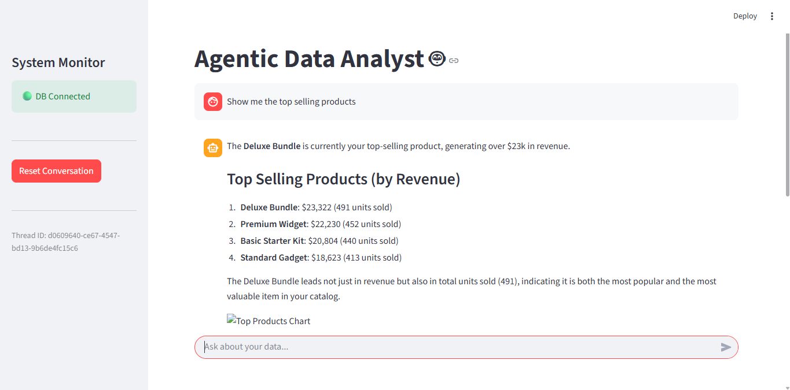

# E-Commerce Data Science Agent System

## Overview
The **E-Commerce Data Science Agent System** is an intelligent, agentic data analysis platform built with [LangGraph](https://langchain-ai.github.io/langgraph/) and [Streamlit](https://streamlit.io/). It orchestrates a team of specialized AI agents to autonomously analyze e-commerce data from a SQLite database, generate actionable insights, and create rich visualizations. The system allows users to interact via a natural language chat interface, making advanced data analytics accessible to non-technical stakeholders.

## Business Context
In the fast-paced world of e-commerce, data-driven decision-making is a competitive advantage. However, extracting insights often requires technical expertise in SQL and Python, creating a bottleneck where business stakeholders must wait for data analysts to answer questions. This project automates routine and some relatively complex analytical tasks, enabling real-time access to key business metrics and deeper behavioral analysis.

## Problem Statement
Business teams often struggle with:
-   **Dependency on Data Teams**: Simple questions like "What is our average order value?" or complex ones like "Are the results of this A/B test significant?" require ticketing and waiting.
-   **Fragmented Tools**: Analysis often happens in silos (Excel, SQL clients, Notebooks), making it hard to maintain context.
-   **Lack of Interactivity**: Static dashboards don't allow for follow-up questions or ad-hoc deep dives.

There is a critical need for a self-service solution that understands business context and can execute reliable usage of statistical methods.

## Solution
I built a **Stateful Multi-Agent Workflow** using LangGraph that routes user queries to the most appropriate specialist:

1.  **Supervisor Agent**: The "manager" that interprets the user's intent and routes the task to a specialized agent.
2.  **A/B Test Agent**: Specialized in statistical analysis, capable of calculating significance (p-values), confidence intervals, and interpreting experiment results.
3.  **Segmentation Agent**: Focuses on customer grouping logic, such as RFM (Recency, Frequency, Monetary) analysis and behavioral clustering.
4.  **General Analytics Agent**: Handles broad ad-hoc queries, trend analysis, and general operational metrics.

The application is delivered via a **Streamlit** frontend that supports:
-   Natural language chat.
-   Interactive and static visualizations (Plotly/PNG).
-   Session memory to maintain context throughout the conversation.

## Results
Allows excecutives and not technical audience to quickly get insights from the data. This does not however replace the need for data analysts to perform more complex analysis and provide more in-depth insights.

## Challenges
-   **Agent Orchestration**: Designing a robust routing logic in the Supervisor to prevent loops and ensure the correct agent is selected for ambiguous queries.
-   **State Management**: synchronizing the LangGraph state with Streamlit's session state to ensure a seamless user experience during long-running analysis tasks.
-   **SQL Generation**: Ensuring the LLM consistently generates valid, optimized SQL queries for the specific SQLite schema.

## Learnings
-   **Specialization vs. Generalization**: Breaking down the problem space into specialized agents significantly improved the accuracy of the analysis compared to using a single, monolithic agent.
-   **Graph-Based Workflows**: LangGraph's cyclic graph capabilities are essential for "agentic" behaviors where an agent might need to retry a step or ask for clarification before proceeding.
-   **Human-in-the-Loop**: While currently fully autonomous, the architecture supports adding human review steps for critical data operations.

## Techniques
-   **LangGraph**: For building the stateful, multi-agent orchestration graph.
-   **Google Gemini**: High-performance LLM used for routing, code generation, and insight synthesis.
-   **Streamlit**: For rapid development of an interactive, chat-based UI.
-   **SQLite**: Lightweight relational database for transactional data storage.
-   **Plotly & Matplotlib**: For generating dynamic and static data visualizations.
-   **Python-dotenv**: For secure environment variable management.

## Gallery

## Next Steps
-   **Integration**: Integrate with a larger data warehouse or data lake for more complex queries.
-   **Scaling**: Deploy to a production environment with proper monitoring and logging.
-   **Security**: Implement proper authentication and authorization for production use.
- **More Agents**: Add more specialized agents to handle different types of queries such as a time series agent, a clustering agent, a classification agent, etc.

## Connect with me 😉

